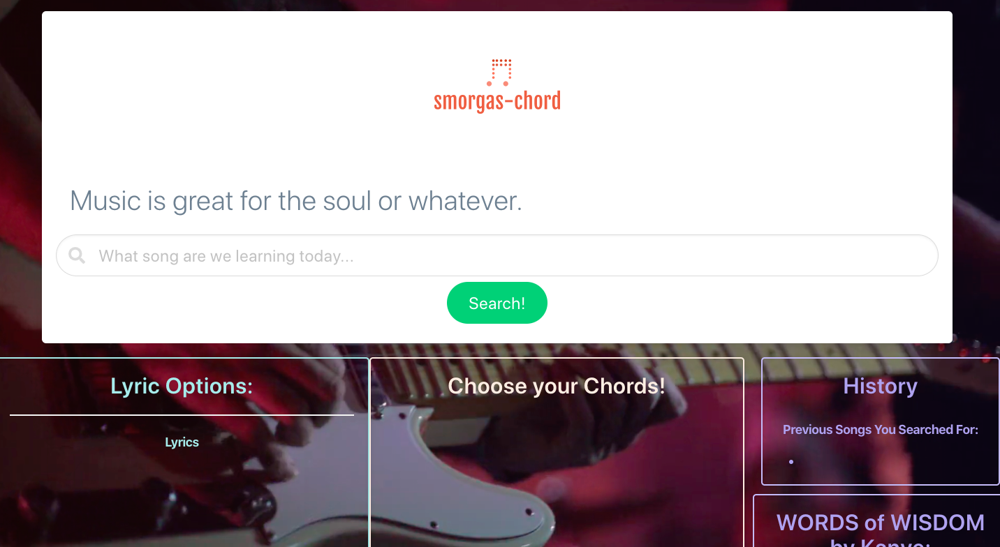

# Smorgas-Chord
This application will allow the user to search lyrics and guitar tabs for popular songs using two different API. The lyrics will appear on the page while the guitar tabs will open into a separate Songsterr page. The previously searched songs will appear in the history as clickable links, should the user want to look through their search history and pull up song and lyric information from previous searches. There is also a peripheral API that will call randomized Kanye West quotes. 

## Deployment Link
https://kkwoka.github.io/Smorgas-Chord/
<<<<<<< HEAD
​
## Table of Contents 
* [User_Story](#User_Story)
​
* [Files](#Files)
​  ​
* [Resources](#Resources)
=======
>>>>>>> d917cd787e743168b31bf0672d16eb95bdc92e7e

* [Images](#Images)
​
## User_Story
```
As a beginning guitar player, I want practice popular songs so that become better at guitar and have an easier time learning songs I do not know.
```
## Files
* index.html
* Assets
    * script.js
    * style.css
* Images
    * Readme-Screenshot.png
    * smorgas-chord.png
    * video.mp4
    
## Resources
* Bulma CSS
* JQuery
* AJAX
* Happi.dev
* Songsterr
* Kanye.rest
* Tippy.js

## Images

